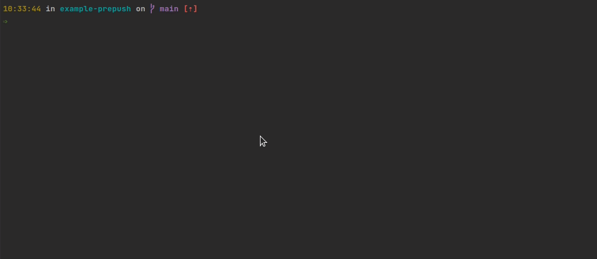

<h1 align="center">Welcome to gradle-prepush-example 👋</h1>

> Running tests before git push using Gradle

## How to use

- Create folder "hooks" in your project root
- Create file "pre-push" to "hooks" folder
- Paste the following code in your "build.gradle"

```shell
task installGitHooks(type: Copy) {
    "cp hooks/pre-push .git/hooks".execute()
    "chmod +x ./git/hooks/pre-push".execute()
}

clean.dependsOn installGitHooks
```

## Install

```sh
./gradlew clean build
```

## Before Usage

```sh
chmod +x .git/hooks/pre-push
```

## Example



## Author

👤 **Eder Matos**

* Website: https://www.medium.ederfmatos.com
* Github: [@ederfmatos](https://github.com/ederfmatos)
* LinkedIn: [@https:\/\/www.linkedin.com\/in\/ederfmatos\/](https://linkedin.com/in/https:\/\/www.linkedin.com\/in\/ederfmatos\/)

## 🤝 Contributing

Contributions, issues and feature requests are welcome!<br />Feel free to check [issues page](https://github.com/ederfmatos-exacta/gradle-prepush-example/issues). 

## Show your support

Give a ⭐️ if this project helped you!

***
_This README was generated with ❤️ by [readme-md-generator](https://github.com/kefranabg/readme-md-generator)_